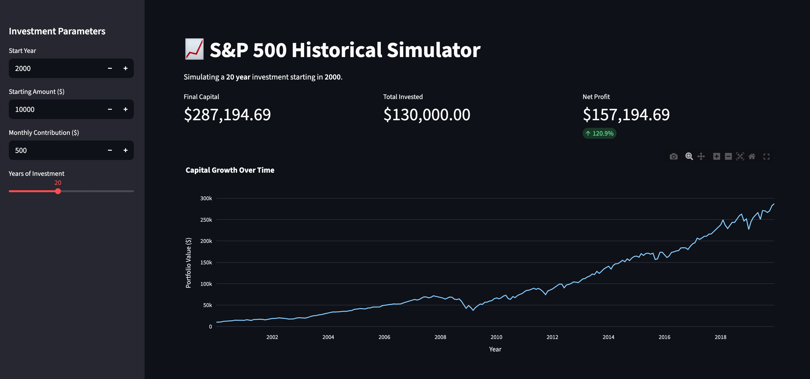

# 📈 S&P 500 Historical Investment Simulator

A financial simulation app built with **Streamlit**, **DuckDB**, and **Python 3.13**. This tool uses historical S&P 500 data to project how initial investments and monthly contributions would have grown over any period in history.



## 🚀 Features
* **Recursive SQL Simulation:** Uses DuckDB's `WITH RECURSIVE` common table expressions for portfolio compounding.
* **Automated Seeding:** Built-in data ingestion from Yahoo Finance via `yfinance` during the Docker build process.
* **Interactive UI:** Real-time adjustments for starting year, initial capital, and monthly contributions.
* **Modern Tooling:** Optimized with [uv](https://github.com/astral-sh/uv) for dependency management and a secure, non-root Docker environment.

---

## 🛠️ Project Structure
```text
.
├── assets/
│   ├── screenshot.png  # Documentation assets
├── src/
│   ├── app.py          # Streamlit dashboard & simulation logic
│   └── seed_db.py      # Database initialization script
├── Dockerfile          # Production-ready container configuration
├── requirements.txt    # Project dependencies
└── README.md           # Documentation
```

## 🐳 Running with Docker

The easiest way to run the app is using Docker. The build process automatically handles dependency installation and database seeding.

### 1. Build the Image
```bash
docker build -t snp500-simulator .
````

### 2. Run the Container
```bash
docker run -p 8501:8501 --name stock-sim snp500-simulator
````

### 3. Access the App
Open your browser and navigate to: http://localhost:8501

## 💻 Local Development
If you prefer to run the app locally, we recommend using uv for speed and environment isolation.

### 1. Create and activate environment:
```bash
uv venv
source .venv/bin/activate
```
### 2. Install dependencies:

```bash
uv pip install -r requirements.txt
Seed the database:
```
### 3. Seed the database:
```bash
uv run src/seed_db.py
Launch the dashboard:
```

### 4. Launch the dashboard:
```bash
uv run streamlit run src/app.py
```